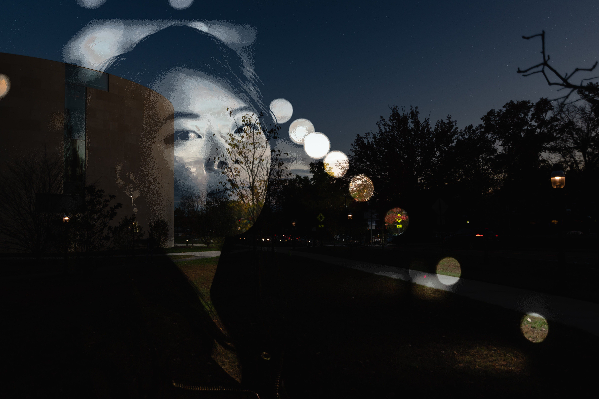

# self_portrait_timelapse
These are the scripts I wrote for my Visual Arts Senior Thesis of Spring 2020, Princeton University. The show happened on March 2-6, in Lucas Gallery in 185 Nassau St. Online show documentation can be found [here](https://www.junehopark.com/vis)

|**Input** | | |
|:-------------------------:|:-------------------------:|:-------------------------:|
| | | |
| | | |
| | | |
||:heavy_plus_sign:||
||||

**Output**: 
## SAMPLES
| | | 
|:-------------------------:|:-------------------------:|
| | |
| | 

## USAGE:
**Requires Python 3
### timelapse.py:
  python timelapse.py [name] [mapping] [--inorder] [--tag]
  - Input:\
  name: name of root folder containing all images\
  mapping: "bin" or "lum" (see Algorithms below)\
  --inorder: If True, assume timelapse go from dark to light (e.g. sunrise timelapse), and vice versa (e.g. sunset timelapse)\
  --tag: optional strings appended to output for organization
  
  - Output:\
  [name]_[...].jpg: output image\
  layer_bw_[mapping]/.jpg: output masks of each layer\
  layer_color_[mapping]/.jpg: output image separated by layer
  
### animator.py:
python animator.py [name] [mapping] [--inorder] [--many] [--count] [--interval] 
 - Input:\
  name: name of root folder containing all images\
  mapping: "bin" or "lum" (see Algorithms below)\
  --inorder: If True, assume timelapse go from dark to light (e.g. sunrise timelapse), and vice versa (e.g. sunset timelapse)\
  --many: If True, takes images from bg_many/ instead of bg/. Ideally when you want to process many timelapse photographs and not have all of them in one frame\
  --count: Only used if many is True. The number of pictures per frame (ppf). Aka the number of timelapse photographs present to produce one frame\
  --interval: Only used if many is True. The interval between each timelapse photograph used to create a frame. 
  
  - Output:\
  animated_[name]_[...].gif: output gif\
  frame_[mapping]_[...]/.jpg: Each individual frame output as jpg
 
## ALGORITHMS
### Notation: 
- N = Number of timelapse photographs
- P = the "plate" or template image

### bin: 
Create N bins, where each bin represents a threshold of luminance values. Given a pixel at (x, y) in P, calculate the luminance of that pixel, and determine which bin *i* it falls into. The *ith* timelapse photograph's pixel at (x, y) will take over.

### lum:
Given a pixel at (x, y) in P, calculate the luminance of that pixel. Then, compare this luminance to the luminance at (x, y) of every timelapse photograph, and find the photo with closest luminance. The pixel at (x, y) of this photo will take over.

### Differences between Algorithms
| Bin | Lum | 
|:-------------------------:|:-------------------------:|
| | |
  
